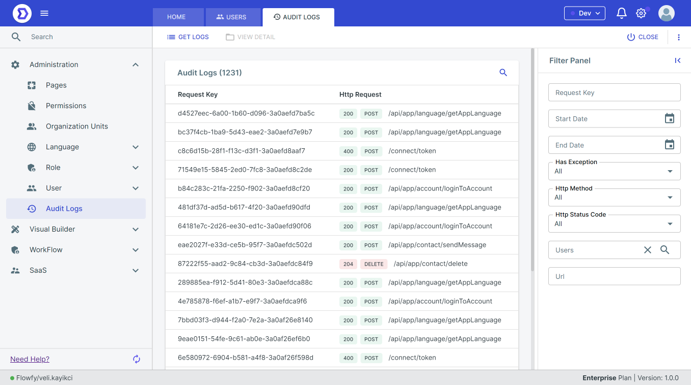
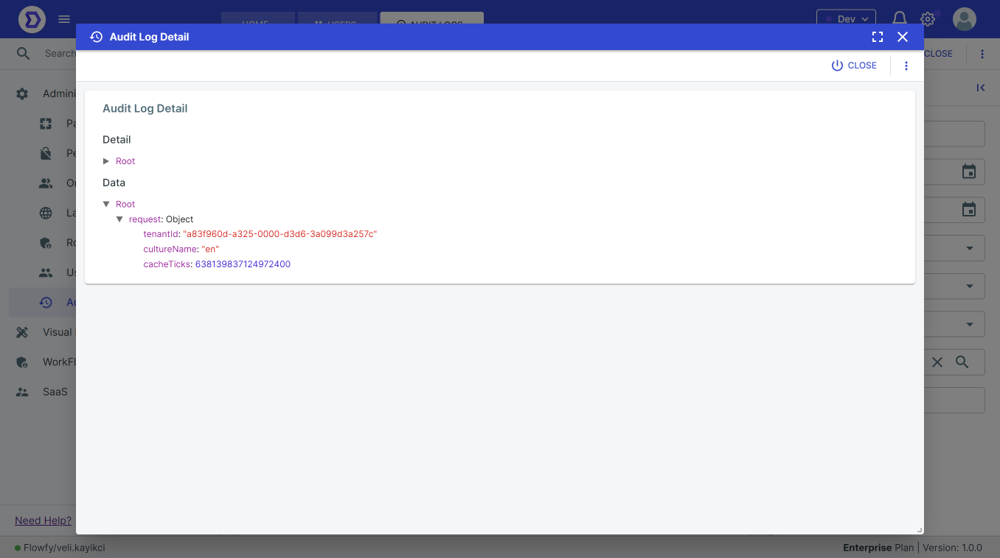

# Audit Logs

Audit logs capture a record of events that occur in the platform, including user actions, system events, and errors. These logs provide visibility into the platform's operations and can be used to troubleshoot issues, monitor user activity, and maintain compliance with regulatory requirements.

### Accessing Audit Logs

Audit logs can be accessed through the platform's user interface or via an API. To access audit logs through the user interface:

* Log in to the platform with administrative credentials.
* Navigate to the "Audit Logs" section of the platform.
* Use the search and filter options to locate the desired log entries.

To access audit logs via the API, refer to the platform's API documentation for instructions.

<figure><figcaption></figcaption></figure>

### Viewing Audit Log Entries

Each audit log entry includes the following information:

* **Date and time**: The date and time the event occurred.
* **User**: The user who performed the action, or the system account that triggered the event.
* **Event type**: The type of event, such as login, logout, or error.
* **Description**: A description of the event.
* **IP address**: The IP address of the user who performed the action, or the system that triggered the event.
* **Additional information**: Additional information about the event, such as the resource or object affected.

<figure><figcaption></figcaption></figure>

### Conclusion

Audit logs are a critical component of any software system, including low-code platforms. By enabling, viewing, and exporting audit logs, you can monitor system and user activity, troubleshoot issues, and ensure compliance with regulations. Follow the steps outlined above to start using audit logs in your low-code platform.
