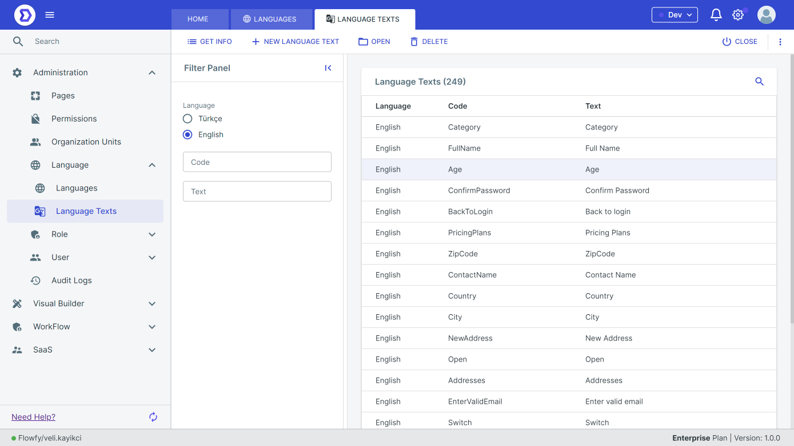

# Language Texts

#### Customizing Labels and Messages

To customize the labels and messages for a language, follow these steps:

1. Navigate to the Language Labels and Messages section in the platform's settings.
2. Select the language you want to customize.
3. Edit the translations for the labels and messages used in the platform.
4. Save your changes.

<figure><figcaption></figcaption></figure>

<figure><figcaption></figcaption></figure>

### Application Language

#### Changing Application Language

To change the application language, follow these steps:

1. Open the application that you want to change the language for.
2. Click on the "Settings" button in the top right corner of the screen.
3. Select the "Language" option from the settings menu.
4. Choose the language you want to use from the list of available languages.
5. Save your changes.

#### Effects of Changing Application Language

Changing the application language affects the labels and messages in the application. When the application language is changed, all labels and messages will be displayed in the selected language. The language change does not affect the underlying logic or functionality of the application.

### Conclusion

The ability to change the application language in the Low-Code Platform allows users to create applications that can be used by a global audience. By following the steps outlined in this document, users can change the language of an application to ensure that it is displayed in the language of their choice.
