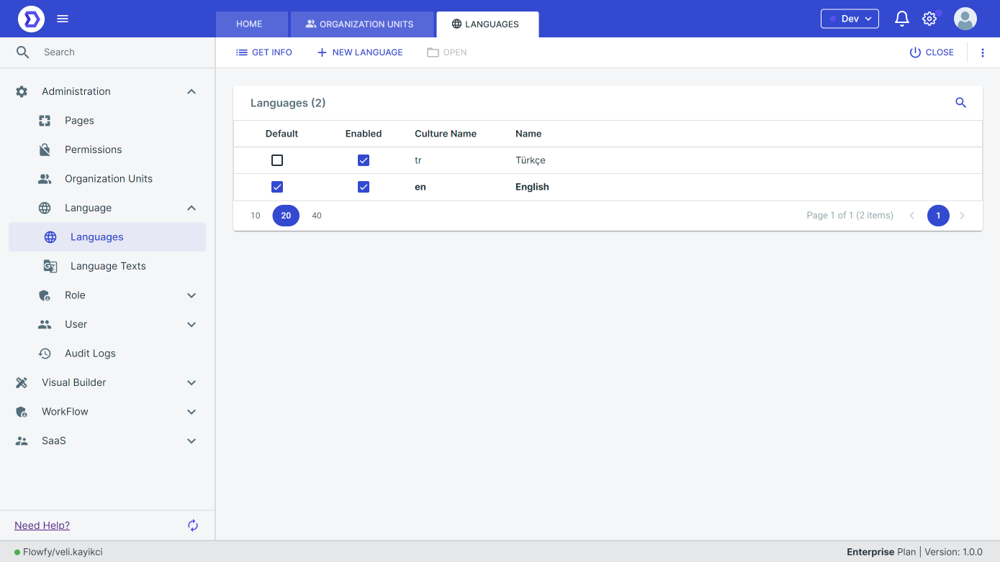

# Languages

Flowfy is provides Language Management functionality that allows users to customize and manage different languages used in the platform. This document describes the Language Management feature and how to use it.

#### Overview

The Language Management feature in Flowfy Low-Code Platform allows users to customize the labels and messages used in the platform for different languages. This enables users to create applications that can be used in multiple languages without requiring extensive programming knowledge.

### Language management

The Language Management feature allows users to:

* Add new languages to the platform
* Customize labels and messages for each language
* Set the default language for the platform
* Enable or disable specific languages

#### Adding a New Language

To add a new language, follow these steps:

1. Navigate to the Language Management section in the platform's settings.
2. Click the "Add Language" button.
3. Select the language you want to add from the list of available languages.
4. Enter the translations for the labels and messages used in the platform.

<figure><figcaption></figcaption></figure>

<figure><figcaption></figcaption></figure>


In Flowfy, all menu items, page names are localized, so if you create a language and select, page names, menu items will come empty. You have to fill them.


#### Setting the Default Language

To set the default language for the platform, follow these steps:

1. Navigate to the Language Management section in the platform's settings.
2. Click the "Set as Default" button next to the language you want to set as the default.
3. Save your changes.

<figure><figcaption></figcaption></figure>

#### Enabling or Disabling Languages

To enable or disable a language, follow these steps:

1. Navigate to the Language Management section in the platform's settings.
2. Click the "Enable" or "Disable" button next to the language you want to enable or disable.
3. Save your changes.
