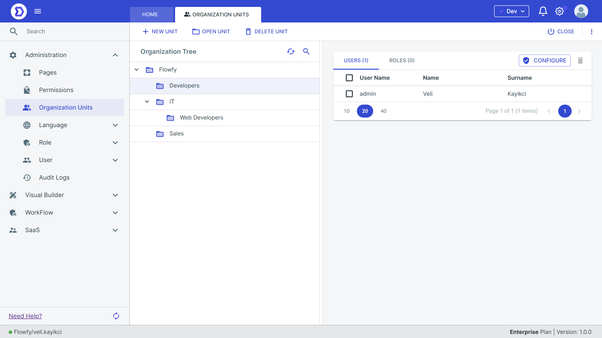
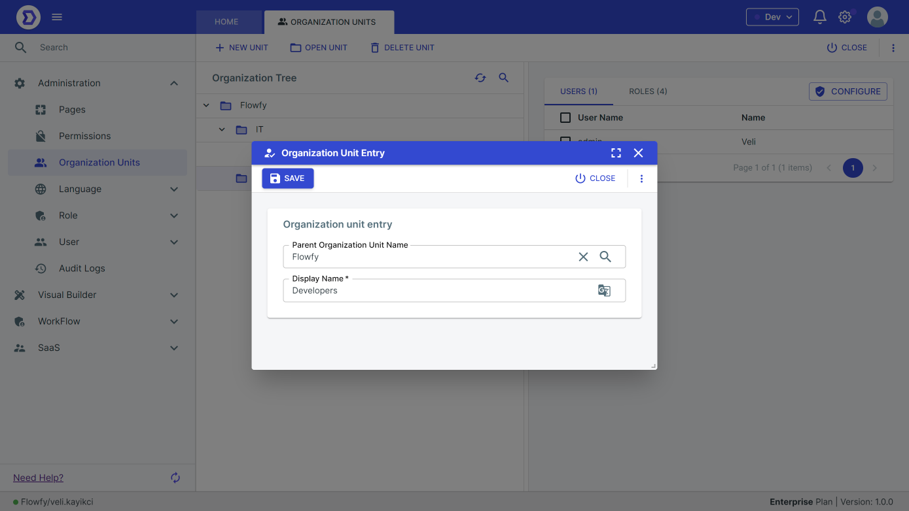
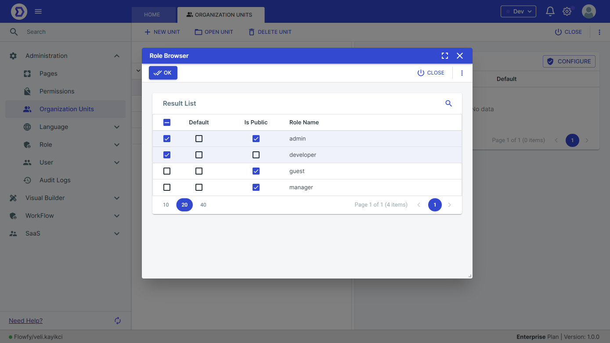

# Organization Units

Flowfy a powerful system for managing organization units within an application. This document describes how to manage organization units using Flowfy.

#### Overview

Organization units in Flowfy allow users to group related resources, such as users and roles, into logical units. Organization units can be used to control access to resources, manage application settings, and track usage metrics.

### Organization Units Management

#### Creating Organization Units

To create a new organization unit, follow these steps:

1. Navigate to the "Organization Units" section in the platform's menu.
2. Click the "New Organization Unit" button.
3. Name the new organization unit and define its settings.
4. Save the new organization unit.

<figure><figcaption></figcaption></figure>

#### Editing Organization Units

To edit an existing organization unit, follow these steps:

1. Navigate to the "Organization Units" section in the platform's menu.
2. Click on the organization unit you want to edit.
3. Modify the organization unit's settings.
4. Save your changes.

### Managing Access to Organization Units

#### Assigning Users to Organization Units

To assign resources, such as users and roles, to an organization unit, follow these steps:

1. Navigate to the "Organization Units" section in the platform's menu.
2. Click on the organization unit you want to assign resources to.
3. Select the "Resources" tab.
4. Check the resources you want to assign to the organization unit.
5. Save your changes.

<figure><figcaption></figcaption></figure>

#### Assigning Roles to Organization Units

To assign resources, such as users and roles, to an organization unit, follow these steps:

1. Navigate to the "Organization Units" section in the platform's menu.
2. Click on the organization unit you want to assign resources to.
3. Select the "Resources" tab.
4. Check the resources you want to assign to the organization unit.
5. Save your changes.

<figure><figcaption></figcaption></figure>

<figure><figcaption></figcaption></figure>

### Conclusion

Flowfy's organization unit management tools provide users with a powerful way to group related resources and manage application settings. By following the steps outlined in this document, users can create and manage organization units, assign resources to organization units, and manage access to organization units within their applications. By using organization units, users can create a more organized and manageable application environment.

