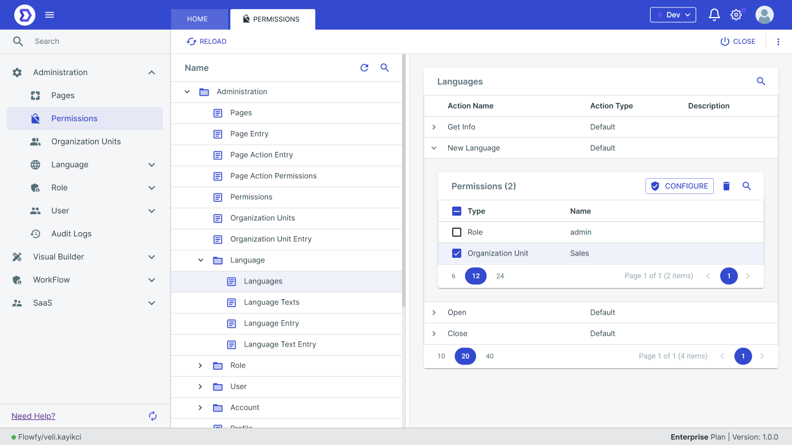
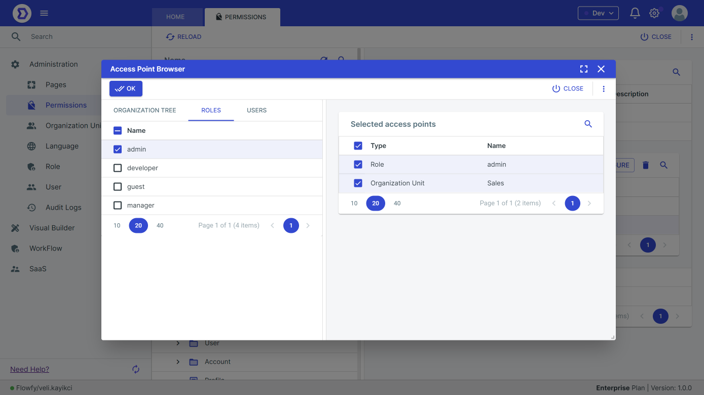

# Permissions

Flowfy provides a comprehensive system for managing permissions within an application. This document describes how to manage permissions using Flowfy.

#### Overview

Permissions in Flowfy allow users to control access to various application resources, such as pages, data sources, and actions. Permissions are assigned to roles, which are then assigned to users. By defining permissions at the role level, users can be granted access to the resources they need without the need for individual permission assignment.

### Permission management

In Flowfy, **Permissions** are actions based, you can manage permissions via actions. If the user doesn't has permission for an action, the action will not shows to user.

You can manage permissions by;

* **Roles**
* **Users**

To manage permissions for resources, follow these steps:

<figure><figcaption></figcaption></figure>

1. Click the **Configure** button to configure permissions.
2. **Access Point Browser** will appear after click **Configuration** button.
3. As you see on the right side, we selected some role, user and organization unit.

<figure><figcaption></figcaption></figure>
