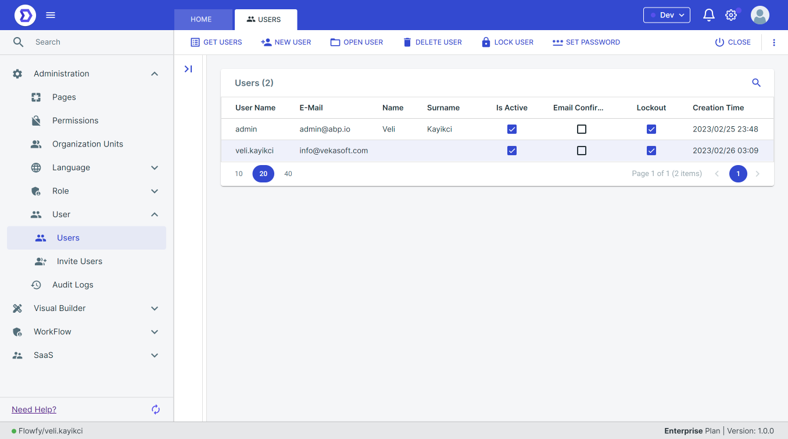
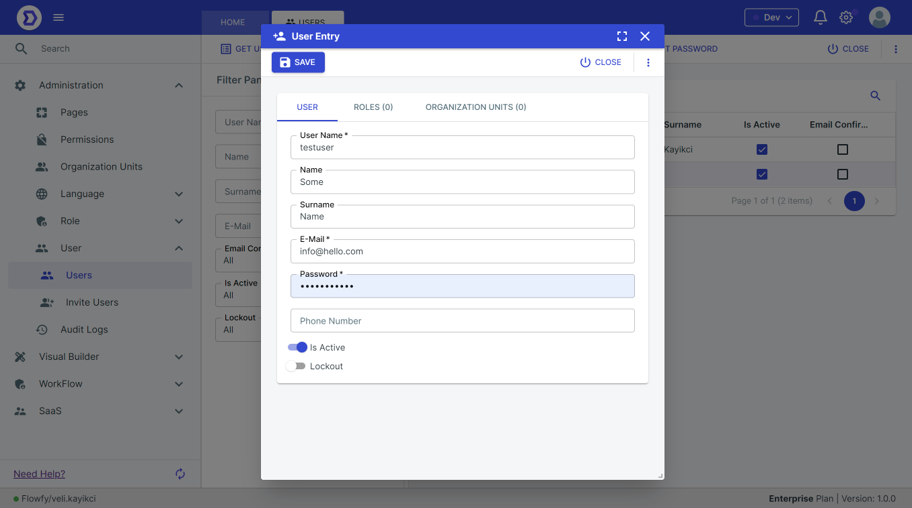

# Users

Low-Code Platform provides a powerful system for managing users within an application. This document describes how to manage users using the Low-Code Platform.

#### Overview

Users in the Low-Code Platform represent individual people who have access to your application. Users can be assigned to roles and organization units, which determine what actions and resources are available to them within the application.

### User management

#### View Users

To create a new user, follow these steps:

1. Navigate to the "Users" section in the platform's menu.
2. Click the "New User" button.
3. Enter the user's details, such as name and email address.
4. Assign the user to one or more roles and/or organization units.
5. Save the new user.

<figure><figcaption></figcaption></figure>

<figure><figcaption></figcaption></figure>

#### Creating Users

To create a new user, follow these steps:

1. Navigate to the "Users" section in the platform's menu.
2. Click the "New User" button.
3. Enter the user's details, such as name and email address.
4. Assign the user to one or more roles and/or organization units.
5. Save the new user.

#### Editing Users

To edit an existing user, follow these steps:

1. Navigate to the "Users" section in the platform's menu.
2. Click on the user you want to edit.
3. Modify the user's details, such as name or email address.
4. Modify the user's roles and/or organization units as needed.
5. Save your changes.

<figure><figcaption></figcaption></figure>

#### Disabling and Enabling Users

To disable or enable a user, follow these steps:

1. Navigate to the "Users" section in the platform's menu.
2. Click on the user you want to disable or enable.
3. Toggle the "Enabled" switch to the desired position.
4. Save your changes.

#### Resetting Passwords

To reset a user's password, follow these steps:

1. Navigate to the "Users" section in the platform's menu.
2. Click on the user you want to reset the password for.
3. Select the "Reset Password" button.
4. Enter and confirm the new password.
5. Save your changes.

#### Assigning Roles to Users

To assign roles to users, follow these steps:

1. Navigate to the "Users" section in the platform's menu.
2. Click on the user you want to assign a role to.
3. Select the "Roles" tab.
4. Check the roles you want to assign to the user.
5. Save your changes.

<figure><figcaption></figcaption></figure>

#### Assigning Organization Units to Users

To assign roles to users, follow these steps:

1. Navigate to the "Users" section in the platform's menu.
2. Click on the user you want to assign a role to.
3. Select the "Roles" tab.
4. Check the roles you want to assign to the user.
5. Save your changes.

<figure><figcaption></figcaption></figure>
