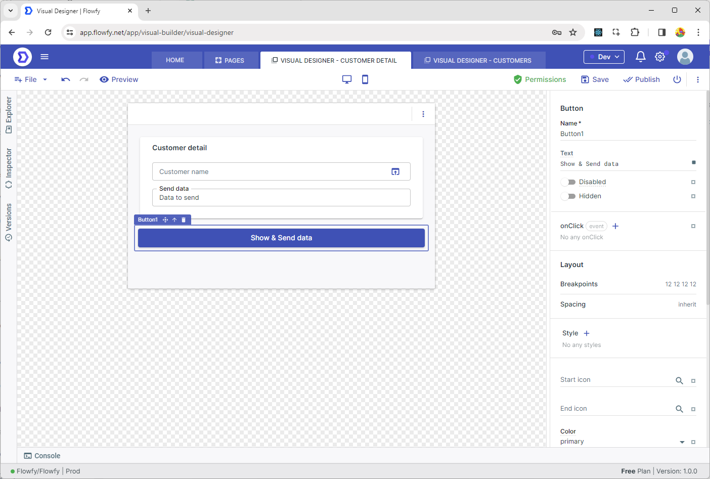

# Send & retrieve data between pages

In this example, we have created 2 pages, the first page is the Customers page where we list the customers, and the other page is the Customer Detail page. From the 'Customer Detail' page, we will open the 'Customers' page, select the desired customer from the list, and set it in the Input field on the 'Customer Detail' page.

## Retrieve Data

1. **Customers Page**

We added a button named 'Select & Close Page' to the Customers page. Let's add a new event by clicking on the On Click event of the button.

<figure><figcaption></figcaption></figure>

We selected the "Close Page" task from the Toolbox and filled in the data we will send to the Customer Detail page in the "Response Data" field. We will send the selected item from the list to the other page.

```javascript
{{ DataGrid1.selectedRow }}
```

<figure><figcaption><p>Event Designer</p></figcaption></figure>


2. **Customer Detail Page**

Now it's time to retrieve the selected customer from the Customers page. For this, we dragged and dropped an input onto the screen and added an action, as shown below:

<figure><figcaption></figcaption></figure>

First, we give a name to the page we will be showing, which we will use in the editor, just like with other queries and APIs. We select the Customer page we created earlier from the Select Page field.

The "Close response type" is the response value returned from the other screen. If the other screen returns an "Ok" response, we will proceed with the operation; otherwise, we will not perform any action. In the example where we selected the "Close Page" task above, we chose "Ok" for the "Response" field.

<figure><figcaption></figcaption></figure>

When we give the name "customerPage" using the "Show Page" task above, it creates a field in the scope called "pages," from which we can select the page.

You can show a page as a Page, Dialog or Popover

<figure><figcaption></figcaption></figure>

As seen below, by setting `{{ customersPage.data.name }}` as the default value of the input component, we are able to view the selected customer.

<figure><figcaption></figcaption></figure>


## Send Data

Now, we will send data from the Customer Detail page to the Customer page. For this purpose, as shown below, we dragged and dropped a button named "Show & Send data."

<figure><figcaption></figcaption></figure>

Now, on the opened Visual Event Designer, we are using the Show Page task. To send data to the other page, we fill in the Page params field with the data we want to send. In this example, we are creating a field named "name" and sending it.

<figure><figcaption></figcaption></figure>

Now, similar to above, we are reading the data sent with Page params using `{{ pageParams.name }}`

<figure><figcaption></figcaption></figure>
